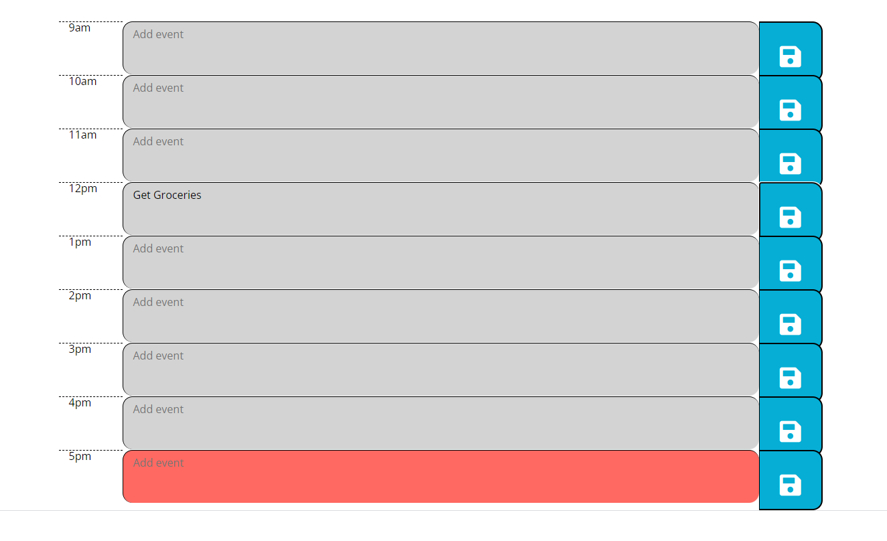

# Work Scheduler

## Description

I added Javascript functionality to a schedule/calendar application to aid in logging past, present, or upcoming events. I learned how to incorporate moment() into existing HTML elements to display the current time, as well as log important information using localStorage.

## Installation

N/A

## Usage

1. Access the application at the provided URL: https://agarfar.github.io/work-scheduler/

2. Click on a text field to add personalized notes

3. Click the save button at the end of each input field to store current text to local storage.

4. Stored input values persist on the page when it is refreshed

5. The background color of each time block changes depending on the current time:

## Credits

N/A

## License

N/A